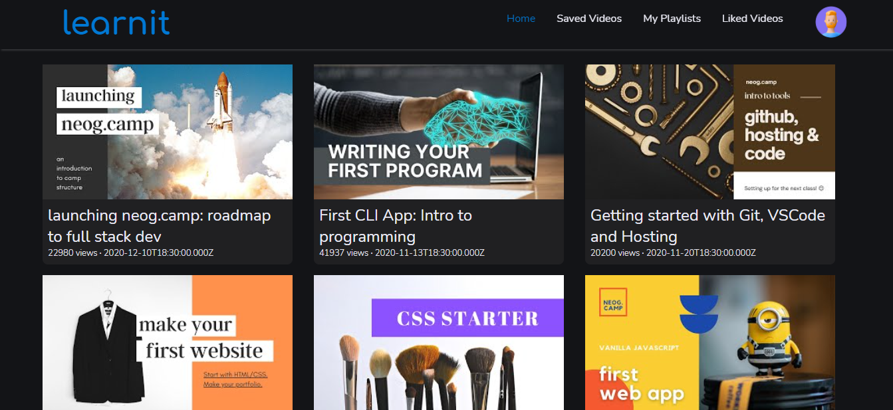
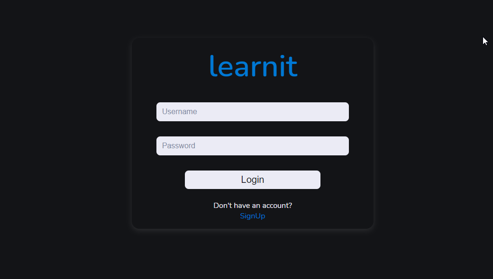
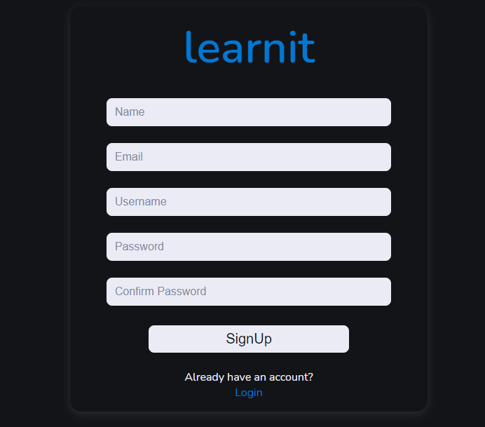
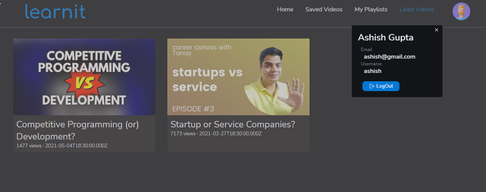
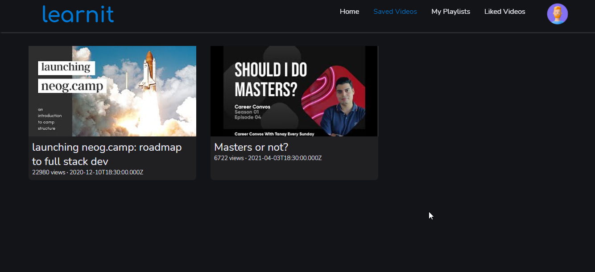
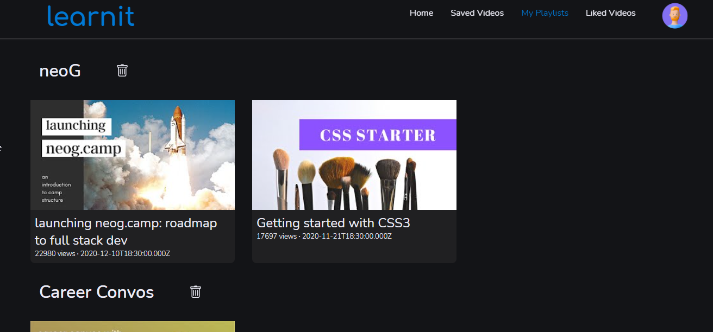
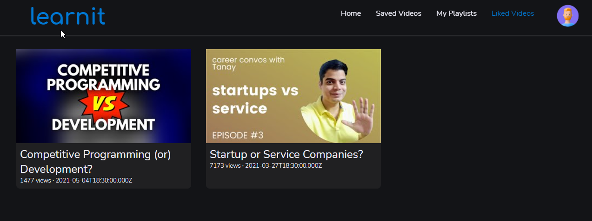
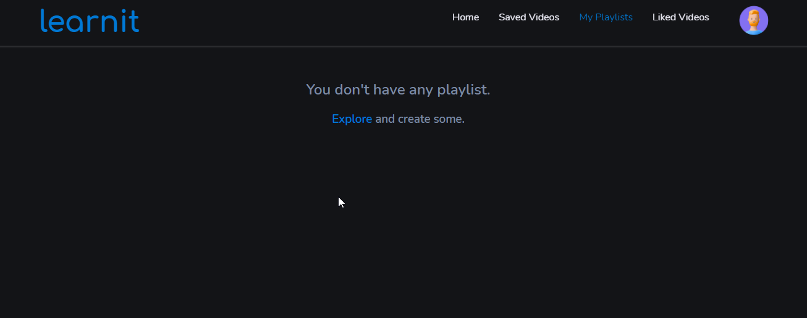

# learnit

Video Library App

Live URL - [learnit](https://learnit-app.netlify.app/)

## Technologies Used

* React
* Express
* MongoDB
* Node

## Features
*  Authentication with `JWT`

## Preview

* Home

* Login

* SignUp

* Profile

* Saved Videos

* Playlists

* Liked Videos

* More Screens
